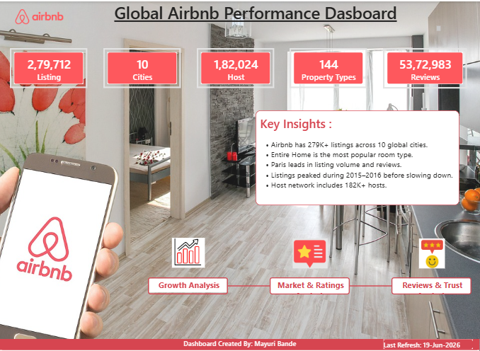
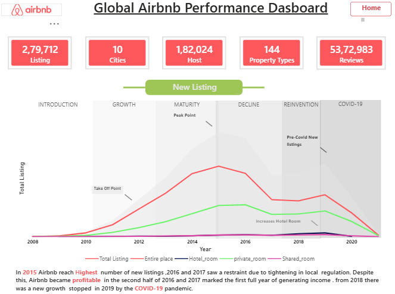
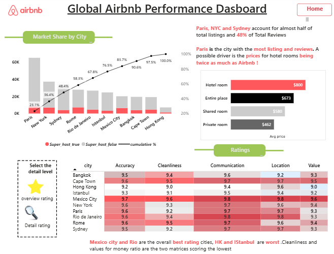
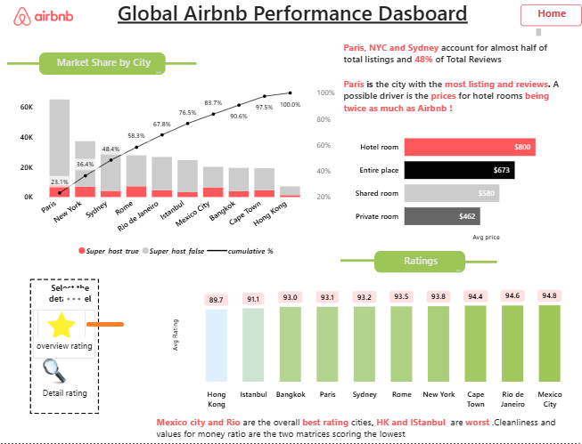
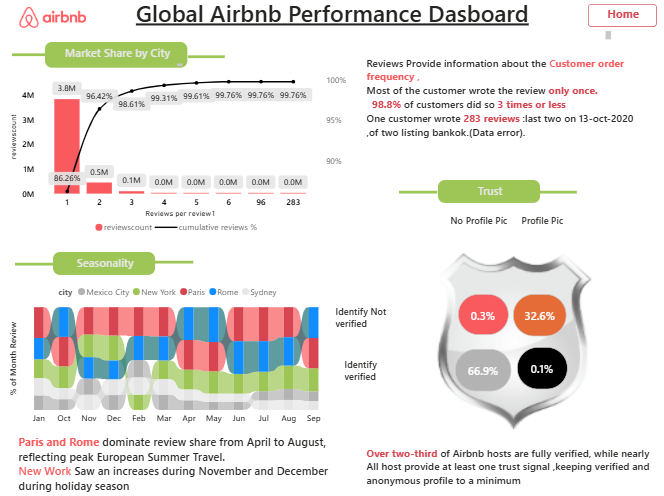

 # Global Airbnb Performance Dashboard

A Power BI dashboard analyzing 279,000+ Airbnb listings across 10 global cities — covering listings growth, pricing, host behavior, and review trends.

## Key Insights
- Paris leads in both listing volume and customer engagement
- Entire homes are the dominant listing type across all markets
- Listings grew rapidly, then plateaued — signaling market maturity
- Host verification correlates strongly with review volume

## Tools Used
Power BI · Power Query · DAX · Data Modeling

## Dashboard Preview

## File
Download  [dashboard.pbix file] (https://github.com/mayuribande/-airbnb-global-performance-dashboard/releases/download/v1.0/Airbnb-performance-dasboard.pbix) and open in Power BI Desktop to explore interactively.
